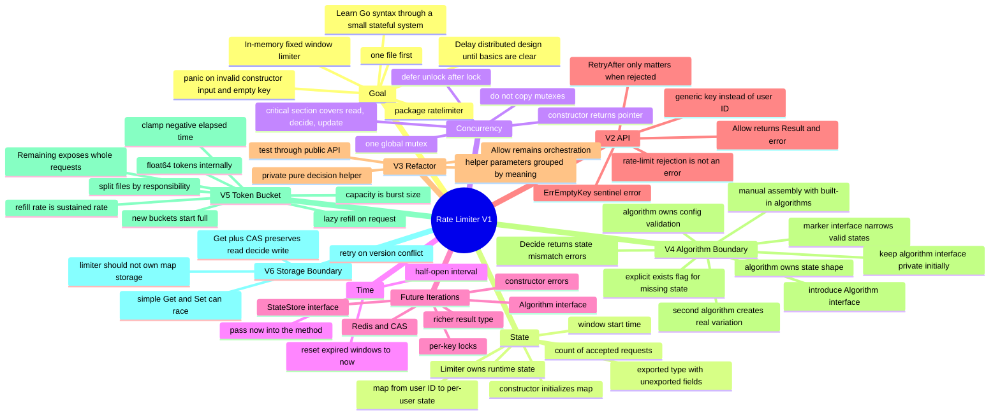

# V1 Learning Mindmap

Back to [[Rate Limiter Learning Map]].

## Linked notes

- [[V1 - Fixed Window#ADR-0001 — Fixed window first|ADR-0001]]
- [[V1 - Fixed Window#ADR-0004 — One global mutex|ADR-0004]]
- [[V1 - Fixed Window#ADR-0005 — Explicit time input|ADR-0005]]
- [[V1 - Fixed Window#ADR-0009 — Defer unlock immediately after lock|ADR-0009]]
- [[V1 - Fixed Window#ADR-0010 — Boolean return for V1|ADR-0010]]
- [[V2 - API Evolution#ADR-0019 — Result-and-error return|ADR-0019]]
- [[V2 - API Evolution#ADR-0020 — Generic rate-limit key|ADR-0020]]
- [[V2 - API Evolution#ADR-0021 — `Result` contract|ADR-0021]]
- [[V2 - API Evolution#ADR-0022 — Sentinel error for empty key|ADR-0022]]
