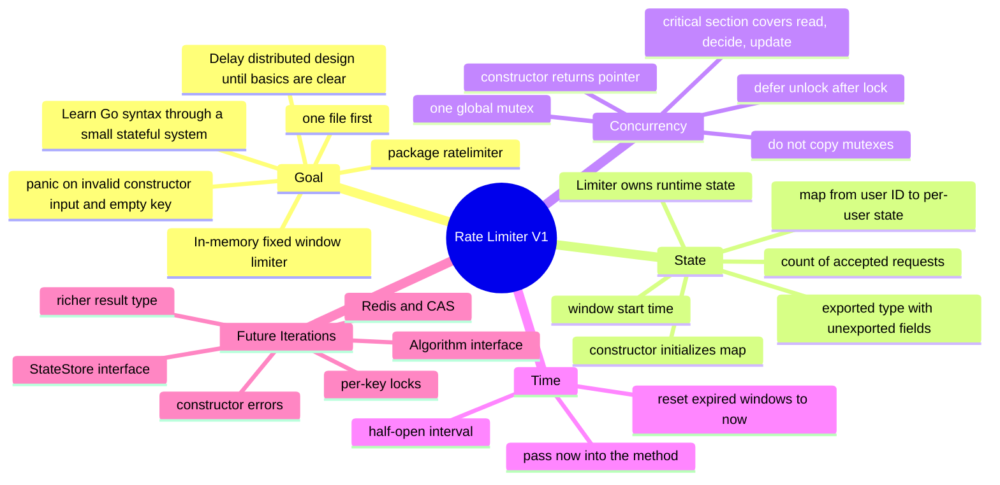

# V1 Learning Mindmap

Back to [[Rate Limiter Learning Map]].

## Linked notes

- [[D01 - Fixed Window First]]
- [[D04 - One Global Mutex]]
- [[D05 - Explicit Time Input]]
- [[D09 - Defer Unlock After Lock]]
- [[D10 - Return Type]]
